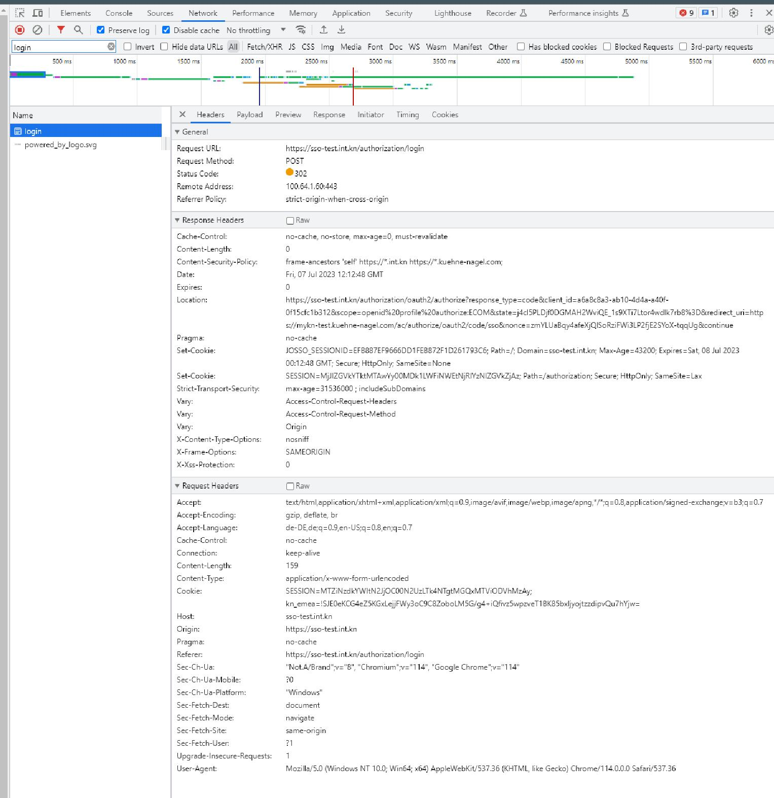

include::{root}/.inc/include.adoc[]

= 32333 [esp-mykn-components] fix local development process

* [X] node 18.12.1  & yarn 1.22.19

https://jira.int.kn/browse/KNOMP-32333[Jira]
link:../kn/esp-dev-launcher.adoc[dev-launcher]

== Doc
https://wiki.int.kn/display/KNESP/esp-dev-launcher+development+setup[wiki]
C:/data/esp-mykn-components/README.md[abc]
https://excalidraw.com/[ports]

== Commandline

[source,bash]
----
rmContainers
# rmImages
rmVolumes ...
docker login -u external.dietmar.zabel harbor.emea.ocp.int.kn
cdd dev-launcher
rebase
rm -rf ./data

dc pull # or ./launcher --pull

dc --profile oracle up # or ./launcher --init-with-oracle # Starts infrastructure like rabbit...
./launcher launch esp-masterdata esp-frontend esp-frontend-services esp-taskmanager esp-administration

# ---------------------------------------------------------------------------------------------------------
# REPORTING Use Intellij! Not ./launcher launch esp-reporting
mvn clean install -DskipTests
#   RunConfig ReportingApplication  Profile: int-oracle,backend,frontend
#   In application-int-oracle.yml
#     datasource:
#        url: jdbc:oracle:thin:@(DESCRIPTION=(CONNECT_TIMEOUT=10)(FAILOVER=ON)(ADDRESS_LIST=(ADDRESS=(PROTOCOL=TCP)(HOST=ompu8-s1.db.int.kn)(PORT=1521))(ADDRESS=(PROTOCOL=TCP)(HOST=ompu8-s2.db.int.kn)(PORT=1521)))(CONNECT_DATA=(SERVICE_NAME=OMPU8_APP.INT.KN)))
#        username: ESP
#        password: yx8eLVnj

# ---------------------------------------------------------------------------------------------------------
# SEARCH Use Intellij Not ./launcher launch esp-search
mvn clean install -DskipTests
#   RunConfig SearchApplication  Profile: <empty>
# ---------------------------------------------------------------------------------------------------------
# Setup Credentials (user: esp.admin   password: Hamburg01 )
http://localhost:8888/admin/users/esp.admin
# Check "KN Technical Support" checkbox !
# ---------------------------------------------------------------------------------------------------------
# Rebuild Shipmebnt
http://localhost:8888/report/api-doc/reporting-rebuild/v2#/rebuild/rebuildReporting
# Press Button "Try it out" !
# Type: SHIPMENT
# Body enter: AD2108I00241 (Tracking 6987836836)
# Optional: Open Reporting-server terminal
# Press Button "Execute" !
# ---------------------------------------------------------------------------------------------------------

cd esp-mykn-components
mvn clean install -DskipTests && yarn build:or --mode development && yarn build:ct --mode development
mvn clean install -DskipTests # For the first time needed

# Root directory:
yarn build:or --mode development # allocated order line table
yarn build:ct --mode development # config table

# root, starting backend
mvn spring-boot:run "-Dwebpack.env=development"
mvn spring-boot:run "-Dwebpack.env=integration"

cd mykn-mock
yarn install

yarn start:integration

# Open mykn-mock/src/App.vue: <allocated-order-lines :tracking-number="3000539965" />

yarn start

----

== Fragen
.Versions Running
----
reporting: 4.0.17, search: 1.0.23, dev-launcher: elasticsearch: 7.17.8
ShpNr: VN2211I00289 TrackingNr: 6599004591
----

== Todo
=== Analyse what does mvn clean install, substitute with yarn call
* Phase: generate-sources -> install-node-and-yarn
* Phase:                  -> yarn build --mode=development
* Phase: test             -> test:coverage --logHeapUsage --bail
* Phase: compile          -> node generate-esp-dependency-info.js

[source, bash]
----
# Root
node generate-esp-dependency-info.js
yarn build:or --mode=development
yarn build:ct --mode=development

cd mykn-mock
yarn install
yarn start

----
* For: https://esp-int.int.kn
  ** User: esp.admin  HamburgHarborBoatTrip0??

https://sso-test.int.kn/authorization/login

