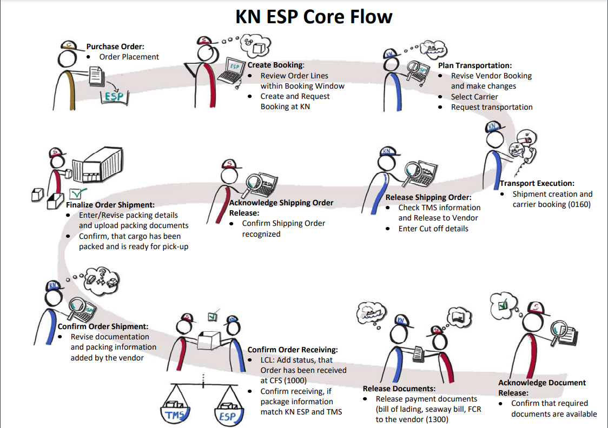

= Logistik

== Begriffe

=== Architecture Miro
* https://miro.com/app/board/uXjVPZWLJvY=/[Architektur]
* Password: Gpexr"!wuVda3SSwedqyYAm

=== Verticale

[NOTE]
====
TODO: "Heading: Ein Satz" Für jede einen kleinen Merksatz dazu schreiben
"Overview Ein Absatz, max 5 Sätze" Dann einen Absatz,
"Detail Eine Seite max 5 Absätze"
====

* Documents
* Reporting: Combines the operational data of ESP into a single model with the purpose to deliver the customer a comprehensive view on his data.
* Search
* Shipment
* 3rd Party Shipment
* TMS Export
* Virtual TMS
* Taskmanager
* PurchaseOrder
* Exceptions
* oedi-data-bridge
* esp-esb-proxy

* Sternschema: Teil von Reporting, esp-query-builder ist der neue Service in dem das läuft

CFS Container freight station: KN Warehouse
CY: Container Yard: Stellplatz im Hafen
SaCo = CFS/CFS (Viele SU, Viele Cu!) (SaCo = Sammel-Container)
BCM  = CFS/CY  (Viele SU, ein   Cu!)  (BCM -> OrdBookNr == null)
Orderline kann auch mehrere Container füllen (FCL Fall)

customer = Tchibo
supplier = Fabrikant für Jogginghosen
Order = from customer to supplier, no I don't accept the order
Booking = Sup - KN do a real transport
  ** bookings are send to TMS
Karen is a Env in the old TMS (ciel?)
Salog is the new Env for TMS, empfängt Daten von Reederei, nur Seefracht 
Ceil ist Salog für Air
ESP Bookings, Order, KundenDaten, alles was Order und Orderlines angeht
trackingNr TMS = shipmentNr ESP
Shipment=Paket oder Ware
Vendor= Verkäufer

ASN Advanced shipping note

Ein TMS ist zB. Salog oder das alte Ciel
Carrier like a reederei
vgm masse
cy cut off container yard when in harbor

Salog = Tms für sea und air, Sealog + Airlog = Salog 

== Map
image::../kn/esp-map.png[Map]

== States 

The `Acknowledge Shipping Order Relase` is probably not correct in the esp-core-flow image

* Purchase Order (Order Line Booking)
* Create Booking (Booking Request)
* Plan Transportation
* Transport Execution
* Release Shipping Order
* Acknowledge Shipping Order Release?
* Finalize Order Shipment
* Confirm Order Shipment
* Confirm Order Receiving (Not in KN-ESP Web)
* Release Documents
* Acknowledge Document Release

== States in KN-ESP Core Flow
* Suppier kann Acceptenc für OrdlerLines
* Orderlines hat der customer angelegt
* Der Supplier sagt ich bin fertit mit prod und möchte liefern

* [ ] Eintragen, wer war der Initiator des States, Warum hat er das gemacht?
* (Cu) & (Su) sind sich vorher schon einig.
  ** Preis, Menge und Datum
  ** Tchibo an Fernost, vertraglich. Wird in SAP eingetragen zB Order Nr.
  ** Wissen aus Erfahrung in welcher Art von Container das paßt

* (Cu) Order Line Booking
  ** Order-placement elektronisch via EDI (Format: KNLORD = Logistik Order) im ESP
  ** Pro Line ein Artikel-Typ
  ** SAP vom Cu sendet das an den ESP

* (Su) Request Booking 
  ** Review Order Lines
  ** Create Booking: Wunsch an KN: Datum, Menge, Orte, ob das geht.
  ** passiert im ESP
  ** [ ] Welche Eigenschaften verbinden die Orderlines?

* (KN) Transportation Planning
  ** Review Booking, KN kann noch Änderungen einpflegen
  ** Select preferred! Carrier (nur FCL), kann auch noch geändert werden. LCL, KN ist verantwortlich den Container voll zu kriegen
  ** "Request transport" gedrückt, -> Erste EDIORD ans TMS! -> State: Transportation Execution "Pending"
  ** EDIORD triggert asynchron das Senden vom TMS der Messages: 8610, 0160 (SEASHP) oder 8610, 0150 (AIRSHP)
  ** (für 8610 muss der KN-TMS-MA das Booking im TMS aufgemacht haben, für Air passiert das automatisch)
  ** (für 0160 & 0150 erst wenn der KN-TMS-MA das geplant hat und der Carrier OK gegeben hat)

* (KN) Transportation Execution "Started"
  ** Started, weil 8610 angekommen ist
  ** Kann ich das machen? Zoll? Rechnung?
  ** Im TMS: Shipment creation -> KN wird die Waren transportieren! Zeitpunkte offen! (Unterschied zum Booking)
  ** Anfrage: `Carrier booking` angelegt von KN an Carrier
  ** Am Ende ist klar, wann und wie der Transport stattfinden soll als Plan.
  ** Status 0160(KN TMS MA bestätigt den Transport)
  ** Status 8610(=Trans Booking started) (TMS Buchung erfolgreich erhalten) vom TMS, bewirkt von Pending nach Execution

* (KN) Shipping Order Release
  ** In der UI: Tracking Tab Neu, Ganz oben auf der Seite: Von wo nach wo geht die Fracht
  ** Im Tab Tracking unter Status Overview kann man die Empfangenen Statusänderungen aus dem TMS sehen
  ** Voraussetzung 8610 & 0160 sind da, sonst startet dieser State nicht.
  ** Anforderung von (KN) an (Su): Bis wann der Container im Hafen sein muss.
  ** Cut off details klar im ESP für den (Su)
  ** Ready for Shipping Order Release 0160

* (Su) Shipping Order Release Acknowledgement
  ** Wird in Zukunft entfernt
  ** Confirm Shipping Order recognized
  ** Passiert aktuell automatisch: (Su) stimmt implizit dem Cut-off date zu.

* (Su) Shipment Finalization
  ** Letzte Möglichkeit zu sagen was transportiert werden soll.
  ** Jetzt müssen die Laufhosen wirklich fertig und verpackt sein.
  ** Add Packaging details and missing documents, ContainerNumber, SealNumber
  ** Confirm Package ready for pick-up

* (KN) Shipment Confirmation
  ** Revise (=Überarbeiten) documentation and Packaging information
  ** (KN) bestätigt und sendet damit zweite EDIORD mit Container-, SealNumber... ans TMS

* LCL Fall: (KN+Su) Confirm Order Receiving
  ** Confirm receiving of cargo
  ** (KN): Zählt Karton, prüft Gewicht
  ** Nachricht vom TMS ans ESP; ESP prüft, ob die Daten aus Finalize mit TMS stimmen

* (KN) (Su) Release Documents
  ** Event 1300 Schiff losgefahren (Actual Departure)
  ** Dokumente vom (Su) vorbestellt
  ** Release Bill of landing (Frachtbrief), seaway bill (Seefrachtbrief)
  ** Release FCR (Empfangsbescheinigung)

* (Su) Acknowledgement Release Documents
  ** Wird in Zukunft entfernt
  ** Confirm that required documents are available

* Confirm ASN (Advanced Shipping Notice) Readiness
  ** ASN prepares the customer of the arrival for the goods
  ** Da Schiff losgefahren, ist die Ankunft genauer gekannt.

== Begriffe
* Orderbooking Nr = ESP business Key ganz elementar, ist oben zu sehen ESP
* Orderbooking-TMS-Referenz kennt nur das TMS
* OrderBookingTMSReferenz transport benötigt immer ein shipment.
* booking = Anfrage
* shipping = shipment = orderShipment = orderShipping
* Booking == OrderBooking!
* Orderbooking = Order bestehen ja schon vorher und wird auf ein booking gebucht
* PurchaseOrder = Das wird gekauft, Rechnungsposition, teilsendung dadrin, bekommt eine OrderLine zugewiesen.
* OrderLine = das was wirklich verschifft wird, werden upgedatet, haben versionen
* 2 Stages: 1. TMS, 2. ESP
* MMP high: Einfachste verwendbare produkt, das wichtig ist.

== Orderline Daten
* Route Plan
  ** Shipping Window: Dann muss das Schiff tatsächlich losfahren, sonst kann das Arrival Window nicht gehalten
  ** Incoterms (Lieferklauseln): Vereinbarung wer die Versicherung zu bezahlen hat
  ** Carrier: Reederei, zB. Mersk
  ** Carrier Contract Nr: Optional, zwischen Kunden und Reederei

* Parties
  ** Warehouse: Ziel Warenhaus
  ** Consignee: Warenempfänger
  ** Supplier: Rolle und Hersteller

* Order Header
  ** Die Infos, die für alle Orderlines gelten
  ** PO = Purchase Order
  ** FCE = SAP Nummer, unwichtig.

* **FCL** steht für Full Container Load, also volle Containerladung. Damit ist ein Container gemeint, der als Ganzes und verplombt auf Reise geht. Es spielt keine Rolle, ob der Behälter komplett gefüllt ist.
* **LCL** steht für Less Than Full Container Load, also eine Teilladung in einem Container. Es handelt sich um Stückgut oder Sammelgut, das in einem Behälter zusammen mit anderen Lieferungen zu transportieren ist. Konkret handelt es sich um eine geringere Menge, zu der zusätzlich eine andere Ware geladen werden kann

OrderBookingNumber:       DE1904I00373
ShipmentNumber:           CN2301000000-01 mit version 1 eines Transportes, gebildet aus OB-TMS-Ref
OrderBookingTmsReference: CN2301000000-01
TrackingNumber            (value=3251056600, communicationCounter=2) = KNComRef ohne A & S
KNComRef                  A32S51056600 ,[0] immer A, [3] immer S (Immer vorhanden)
containernumber:          MSWU0027991 [3] immer U

