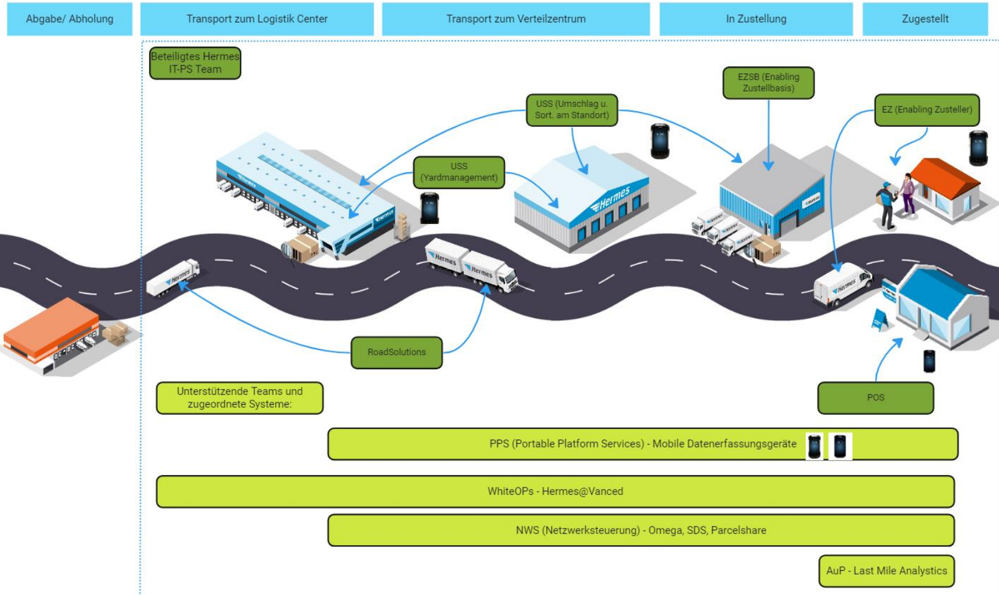

include::{root}/.inc/include.adoc[]

== Übersicht States

* Alt: hermes advanced

== Projekte

===  MAC: MultiAppCockpit
* Steuerung wer was darf, 2J gerade in der Einführung
* mac-ui (web-client)
* multiapp (android-client)
* mac-api (backend)
* port-terraform (infrastructure) AWS

  ** DataMatrix und QR Codes

=== AM: Asset Management
* Hardwareverwaltung alle Typen (Drucker, Scanner, Ladestationen), momentan nur auf Staging, noch nicht benutzt
* pps-am-fronend
* pps-am-backend
* pps-am-infrastructure
* port-inventory -> Alle Hardware inventorisieren.
* pps-am-even-processing -> Empfängt events von der Multiapp schickt infos an das Asset Management

=== AM
* Nur die Geräte die nicht regelmäßig erfasst werden.
* Frühzeitige Erfassung, zur Kostenvermeidung, Soll bei allen prozessen in der Verwaltung der HW helfen.
* Circlon Operate, (CHG Tesma, leasing dienstleister, kostenlos aber passt nicht zu hermes, API zu langsam)