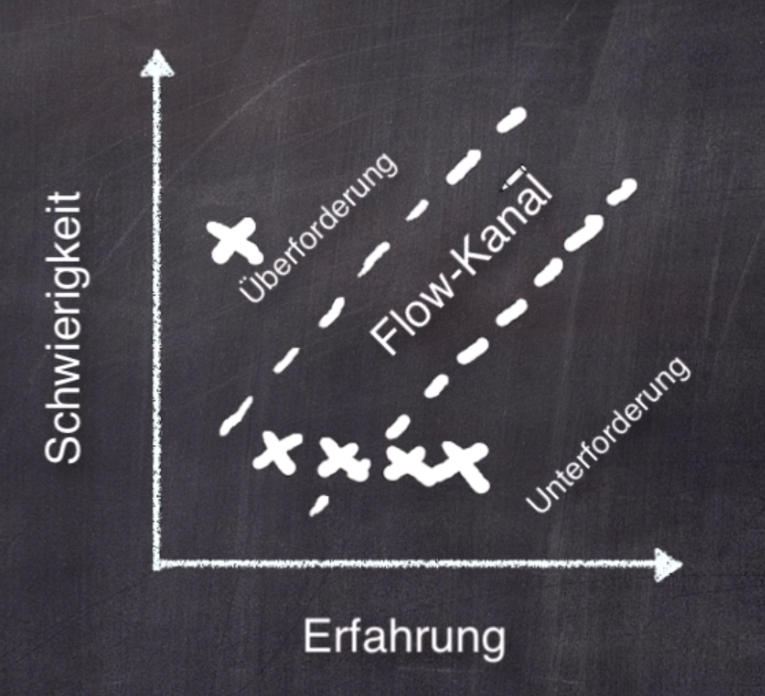

include::{root}/.inc/include.adoc[]

= softwareentwickler

* https://www.udemy.com/course/der-weg-zum-professionellen-softwareentwickler/

== Dreyfus 5 Stufen Modell
* Anfänger
  ** Benötigt Rezept.
  ** Wenig Erfahrung.
  ** Kann Probleme nicht alleine bewältigen
  ** Fehlender Überblick
* Fortgeschritten
  ** Ohne vorgelebte Rezepte bei bekannten Problemen
  ** Kein Interesse für das Ganze
* Kompetent
  ** Entwickelt ein Modell der Domäne
  ** Probleme eigenständig lösen
  ** Nachforschungen
  ** Fehlt die Selbstreflexion
* Gewandte
  ** Selbstreflexion, kann aus seinen und anderen Taten Rückschlüsse ziehen
  ** Leitsätze befolgen und verstehen, zB DRY Regel befolgen
  ** Intuition
  ** Erfahrungen anderer in einen neuen Kontext übernehmen
  ** 40 - 80 mal produktiver als ein Anfänger
* Experte
  ** Arbeitet oft an Standards
  ** Starke Intuition, kann sagen, ja das ist korrekt und nicht wirklich weiß warum
  ** Kann sein Wissen oft nicht ausdrücken

Schwierig ist der Schritt vom Kompetenten zum Gewandten

== Dreiklang
* Imitation, wie müsste ich mich verhalten, wenn eine KompStufe über meiner stehen würde
* Assimilation, dann geht dieses Verhalten in das eigene Handeln über 
* Innovation können dann in dem neuen Level erreicht werden.

== 9 Werkzeuge schärfen
1. Ziel setzen und Ziel und Weg reflektieren
2. Bei jeder Arbeit versuche etwas zu lernen
3. Morgens für 15min ein Code Kata lösen

Oder

Tagesaufgabe: Morgens überlege ich mir ein Prinzip oder einen Gedanken, der mich den Tag über beschäftigen soll.
Diesen schreibe ich auf und immer, wenn ich mal einen Moment Zeit habe. Beispiel: An den Kunden denken. Oder: An
den Pfadfinder denken und den Code immer etwas aufgeräumter verlassen, als man ihn gefunden hatte.

Wichtig: Die Reflexion am Abend: Was habe ich gelernt, was war gut, was war schlecht, hab ich professionell reagiert...

Lernen geht nur mit Spaß
Lerne die Konzepte
Als Gamedesigner müssen Ponnyhöfe u.U. das Größte in deinem Leben sein

Architekturdokumentation nur ADRs (Architecture decision records)

Die horizontalen X zeigen, zB. einen Bergsteiger, der immer auf den selben Berg steigt
Die Aufgabe muss fordern, nur nicht überfordern

== SMART
* Spezifisch klar definiertes Ziel
* Messbar
* Angemessen, muss realistisch sein
* Relevant muss einem etwas bedeuten
* Terminiert, zeitlich begrenzt

* 61 Nie 100% aller Resourcen in die aktuelle Bedrohhung stecken. 
  ** Weiterhin weiterbilden und an einer Strategie arbeiten
* 64 20% der Zeit zum Lernen verwenden. Jeden Tag reflektieren, was habe ich gelernt?

// '''''''''''''''''''''''''''''''''''''''''''''''''''''''''''''''''''''''''''''''''''''''''''''''''''''''''''''''''''''
== Allgemein (Eigene Source)
* Wenig Copy Paste, Befehle lieber wieder hinschreiben
* Weniger Google
* Typen im Baum suchen, nicht greppen.
* Lernen durch Vortagen. Folien erstellen: http://de.slideshare.net/mploed/bessere-prsentationen-10089664
* Ein Projekt o-o eine reservierte Zeitphase, bis Ziele erreicht.
  Lernorganisation
* Was ist der Gemeinsame Nenner? Web: Html, CSS Java EJB, Tomcat, Apache, JBoss
* Zeitkonten schaffen: IT, Lernen, Unternehmen(Steuer), Sport, Freizeit
* Sprint mit gemischten Stories
* Das Scrum Board nutzen.
* Lernkarten aktivieren.

== Verbesserungen
* Bei Sprints immer einen Zettel bewegen oder einen Stift umd Stops zu markieren
* Wenn Arbeit zu lange dauert rechtzeitig Hilfe erbeten
* Taskzettel schreiben um sie später wieder abnehmen zu können
* Arbeiten müssen schneller erledigt werden
* !!! Entspannung abschalten Lernen und Einplanen !!!

== Lernfähigkeit erhöhen
* Nicht Greppen in den Souren sondern lernen!
* Commandos explizit wieder runterschreiben, das Lernt!

== Nicht in aller Tiefe lernen, die Fakten reichen aus:
* Was ist eine NoSQL DB, welche Typen gibt es, welche Einschränkungen. Ende.
* Lernen nach Projekt Wahrscheinlichkeit: CSS Frontendkram war bislang immer dabei!

== Architektur Themen
* Eine Architektur entwerfen: iSAQB Advanced Beispielaufgabe https://www.youtube.com/watch?v=VspImCV5mi8[Eberhard Wolff]

== Qualitätsmerkmale ISO 25010
* *Funktionale Eignung*: Vollständigkeit, Korrektheit, Angemessenheit
* *Leistungseffizienz*:  Zeitverhalten, Verbrauchsverhalten, Kapazität
* *Kompatibilität*:      Koexistenz, Interoperabilität
* *Benutzbarkeit*:       Verständlichkeit, Erlernbarkeit, Bedienbarkeit, Fehlervermeidung, Ästhetik, Zugänglichkeit
* *Zuverlässigkeit*:     Reife, Verfügbarkeit, Fehlertoleranz, Wiederherstellbarkeit
* *Sicherheit*:          Vertraulichkeit, Integrität, Nichtabstreitbarkeit, Zurechenbarkeit, Authentizität
* *Wartbarkeit*:         Modularität, Wiederverwendbarkeit, Analysierbarkeit, Änderbarkeit, Prüfbarkeit
* *Übertragbarkeit*:     Anpassbarkeit, Installierbarkeit, Austauschbarkeit
