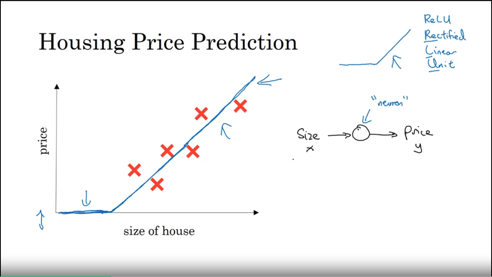
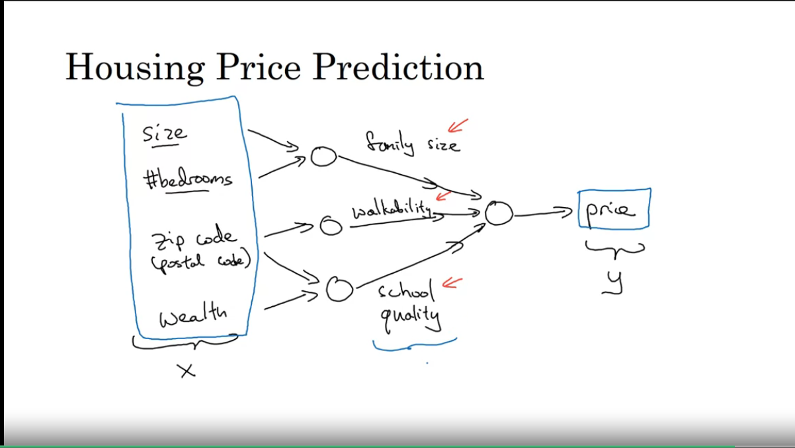
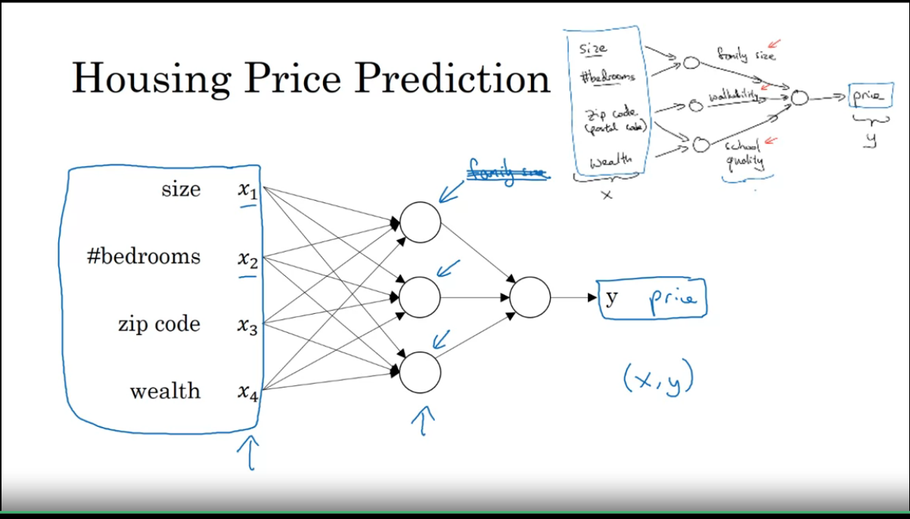

include::{root}/.inc/include.adoc[]

= Coursera Neural Networks Deep Learning
// Artificial intelligence, Neuronale Netze

*

== W1

.Neuron implementation using a ReLU (=Rectified Linear Unit) function

.But every neutron gets every x

* Meistes Geld: x(Userverhalten), y(Richtige Werbung) -> Clicks sammeln
* Real estatate -> Immobilie
* m = #labeled training data
https://bit.ly/42eHskh[Forum]
* Bilddaten werden oft CNN Verwendet
* supervised learning, der Versuch f(x,...) mit den lerndaten zu erhalten

== Notation W2

----
m = {(x1,y1), (x2,y2), (xm,ym)}

    |x11 x21 xm1| ↑
    |x12 x22 xm2|
X = |x13 x23 xm3| nx = [[x11 x21 xm1], [x12 x22 xm2], [x13 x23 xm3],[x14 x24 xm4],[x15 x25 xm5]]
    |x14 x24 xm4|
    |x15 x25 xm5| ↓
    |←--- m ---→|

m  = #trainings examples, Images
nx = Pixel,

x ∈ R^(nx)
X ∈ R^(nx * m)

X[m][nx] oder X[ImageIdx][PixelIdx]

Python; X.shape = (nx,m) => (5, 3)
----

* Aus <<yt-1>>
  ** Aufteilen in training und testing-set
  ** Linear sieht schlecht aus mit training set als eine flexible
  ** Zur optimierung wird die Line so langer verschoben bis (ΔY)² minimal ist. (Quadratischer Fehler genannt bias)
  ** Das Squiggly interpolationsverfahren scheitert aber am testing-set
  ** Die Squiggly Line is "over-fit"
  ** The difference in fits between data sets is called variance

== Logistic Regression
* when the output labels Y in a supervised learning problem are all either 0 or 1
* Y^ = P(y=1|x), y^ sagt, die Wahrscheinlichkeit das x ein Katzenbild (y=1) ist
* Output "Labels" sind die Ausgänge Y

* w = Dies sind die Gewichte oder Koeffizienten, die jeder unabhängigen Variablen in Ihrem Modell zugeordnet sind. In einem einfachen Modell mit nur einer unabhängigen Variablen ist w ein einzelner Wert, aber in komplexeren Modellen mit mehreren unabhängigen Variablen gibt es ein Gewicht für jede Variable. Diese Gewichte bestimmen, wie stark jede unabhängige Variable die Vorhersage beeinflusst.
* b = Dies ist der Bias (oder Intercept) des Modells, ein zusätzlicher Parameter, der die Ausgabe der logistischen Funktion unabhängig von den Eingangsdaten verschiebt. Der Bias ermöglicht es dem Modell, die Ausgabe anzupassen, auch wenn alle Eingabefeatures null sind.

* σ(z) = 1 / ( 1+e(−z) ) // Sigmoid-Funktion

* z = w1*x1 + w2*x2 +...* wn-xn + b

* z = *w* + *x* + b // bold, vektorielle schreibweise

* Die Ausgabe der Sigmoid-Funktion liegt immer zwischen 0 und 1
* Üblicherweise 0,5 >= als 1, < 0,5 als 0
* Training = finde ws und b

=== Kreuzentropie-Kostenfunktion
L misst die Diskrepanz zwischen den tatsächlichen Labels y und den vom Modell vorhergesagten Wahrscheinlichkeiten y^. Hierbei repräsentiert y das tatsächliche Label der Daten (0 oder 1 in einem binären Klassifikationsproblem) und y^ die vom Modell vorhergesagte Wahrscheinlichkeit, dass das Label 1 ist.

----
L = −( y log(y^) + (1−y) log(1−y^) )
L = −( ---a----- + ------b-------- )
a = Bestrafung falls y=1 aber y^=0 -> L groß!
b = Bestrafung falls y=0 aber y^=1 -> L groß!
y = y^ = 1 -> L = 0 und y = y^ = 0 -> L = 0
----

[asciimath]
++++
J = -1/m sum_(i=1)^m [y log(y^) + (1−y) log(1−y^) ]
++++

== Weiter
https://www.youtube.com/watch?v=EuBBz3bI-aA&t=191s
https://www.youtube.com/watch?v=yIYKR4sgzI8&t=73s
https://www.youtube.com/watch?v=bMccdk8EdGo

[bibliography]
- [[[yt-1]]] https://www.youtube.com/watch?v=EuBBz3bI-aA&t=191s[ML-fundamentals]
- [[[cs]]] https://www.coursera.org/learn/neural-networks-deep-learning/[coursera]

